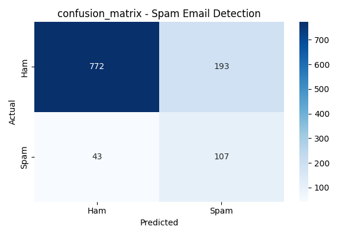
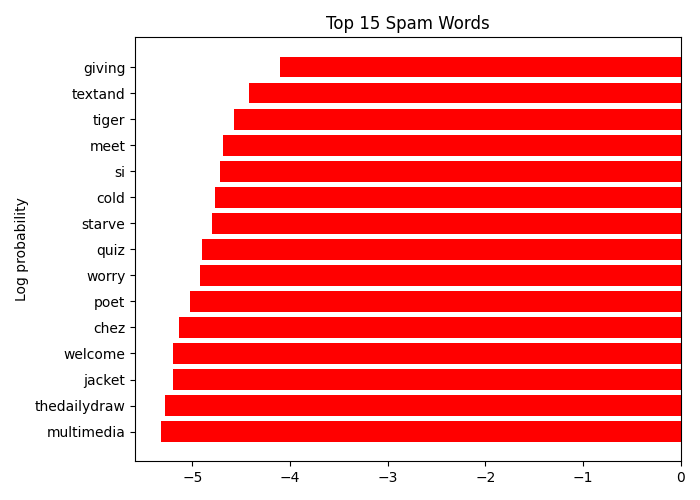

# 📧 Spam Email Detection

A machine learning project that classifies emails as **Spam** or **Ham (Not Spam)** using the Naive Bayes algorithm and Bag-of-Words feature extraction.

---

## 📁 Project Structure

```
Spam-Email-Detection-Project/
│
├── Spam_email_detection.py   # Main Python script
├── spam.csv                  # Dataset
├── confusion_matrix.png      # Model evaluation heatmap
├── top_spam_words.png        # Top 15 spam indicator words
├── requirements.txt          # Dependencies
└── README.md
```

---

## 🧠 How It Works

1. **Load & Explore** — Reads the SMS Spam Collection dataset and performs basic EDA
2. **Preprocess** — Renames columns, maps labels to numeric (ham=0, spam=1)
3. **Feature Extraction** — Uses `CountVectorizer` with English stop words (top 3000 features)
4. **Train** — Trains a `MultinomialNB` (Naive Bayes) classifier on 80% of the data
5. **Evaluate** — Reports accuracy, classification report, and confusion matrix
6. **Visualize** — Plots confusion matrix heatmap and top 15 spam words by log probability

---

## 📊 Results

| Metric     | Value     |
|------------|-----------|
| Algorithm  | Naive Bayes (Multinomial) |
| Vectorizer | CountVectorizer (BOW) |
| Test Split | 20%       |

### Confusion Matrix


### Top 15 Spam Words


---

## 🚀 Getting Started

### 1. Clone the repository
```bash
git clone https://github.com/Chinmoy0907/Spam-Email-Detection-Project.git
cd Spam-Email-Detection-Project
```

### 2. Install dependencies
```bash
pip install -r requirements.txt
```

### 3. Run the script
```bash
python Spam_email_detection.py
```

---

## 📦 Dependencies

```
pandas
numpy
scikit-learn
matplotlib
seaborn
```

---

## 📂 Dataset

Uses the [SMS Spam Collection Dataset](https://www.kaggle.com/datasets/uciml/sms-spam-collection-dataset) — 5,572 labeled SMS messages (ham/spam).

---

## 👤 Author

**Chinmoy0907**  
[GitHub Profile](https://github.com/Chinmoy0907)
